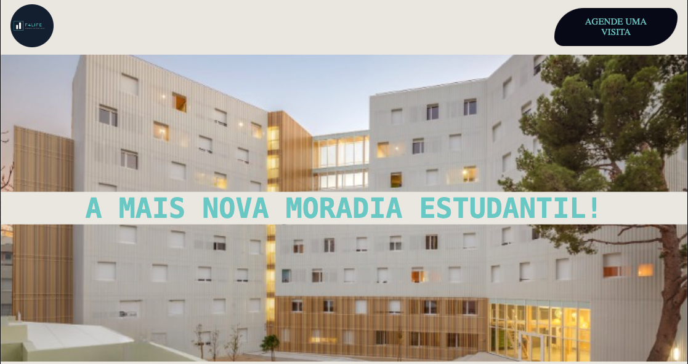
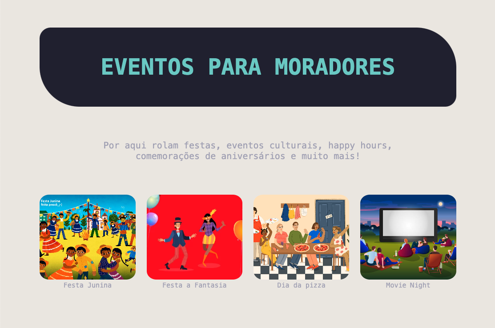
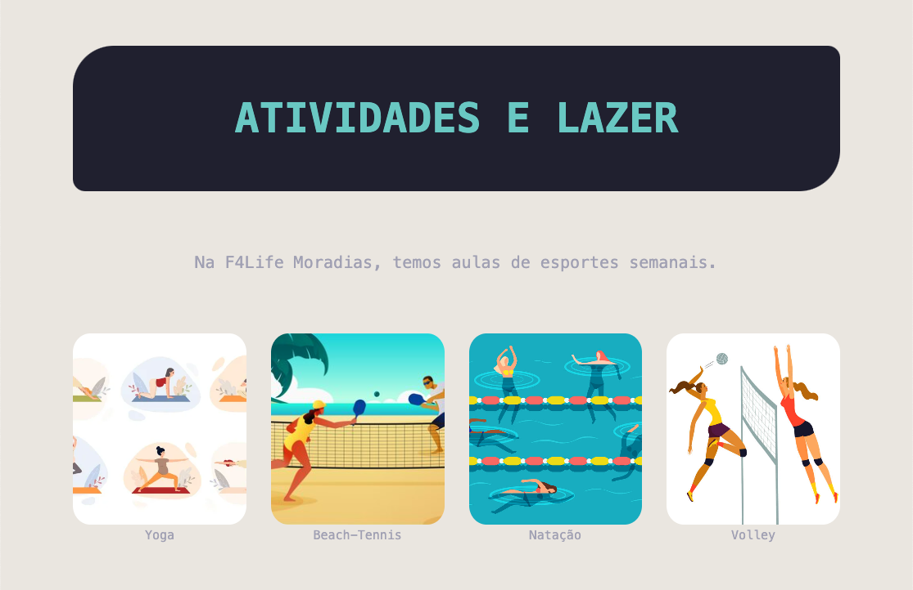
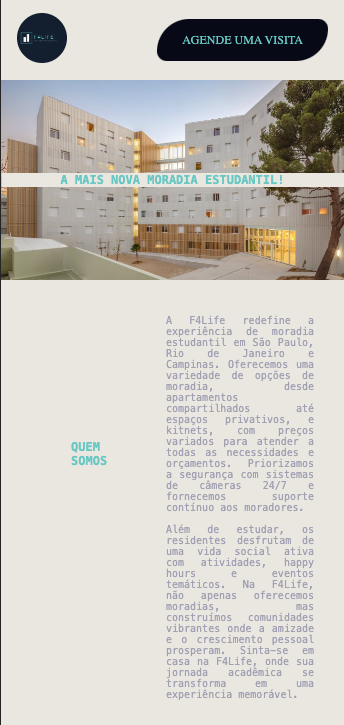
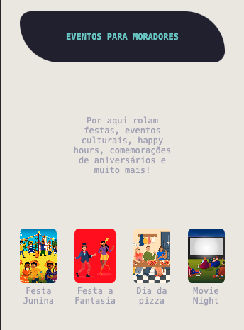
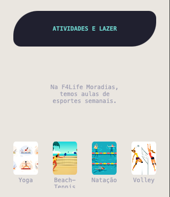
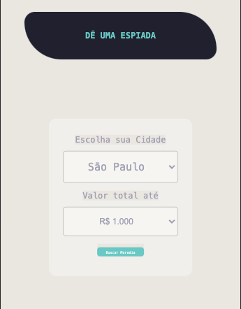
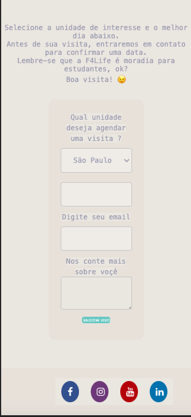

#### Projeto F4Life

  F4Life é uma empresa de aluguéis de repúblicas para pessoas universitárias. Similar aos modelos de Quinto Andar e Loft, a empresa realiza reformas e prepara moradias para recepção de pessoas universitárias em um ambiente específico e otimizado para a vida de graduação. Você precisa criar uma landing page que chame a atenção de pessoas que estão na graduação e ofereça os produtos "moradia compartilhada" e "kitnets".

---------------------------

#### Local do Projeto 
https://abounding-oil.surge.sh/

---------------------------
1. **Qual é a empresa fictícia que será utilizada na página?**
   - A empresa fictícia será **f4Life**.

2. **Onde estarão localizados o cabeçalho e o rodapé?**
   - O cabeçalho será feito no início da página na tag `<nav>`, e o rodapé estará no final da página, dentro da tag `<footer>`.

3. **Qual é o título do site?**
   - O título será **f4Life**.

4. **Quantas seções o site terá e quais serão os nomes dessas seções?**
   - Teremos as seguintes seções: **Moradia, Sobre Nós, Eventos, Lazer, Onde Morar, Agende uma Visita**.

5. **Qual a localização das seções no site?**
   - 

6. **A página terá textos? Em que seções esses textos estarão?**
   - A página terá textos nas seções **Agende uma Visita, Eventos e Sobre Nós**.

7. **A página terá imagens? Em quais seções elas serão adicionadas?**
   - A página terá imagens em todas as seções, exceto na seção **Onde Morar**.

8. **A página terá vídeos? Em quais seções eles estarão?**
   - A página **não terá vídeos**.

9. **Em que seção estará localizado o formulário de contato?**
   - O formulário de contato estará na seção **Agende uma Visita**.

10. **Haverá botões no site?**
    - Sim, haverá botões para **agendar uma visita** e para **ver os apartamentos disponíveis**.

11. **Onde estará localizado o logo da empresa?**
    - O logo da empresa estará localizado na `<nav>`, do lado esquerdo da página.

12. **Qual a localização dos ícones de redes sociais?**
    - Os ícones de redes sociais estarão no `<footer>`.

    -----------------------
    #### Prints da Pagina 

    
    
    
    
    
    
    

#### Prints da versao mobile 

 
 
 
 
 
 
   